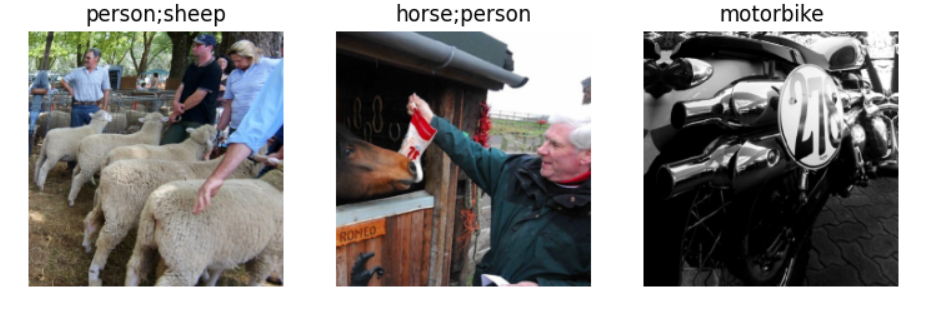
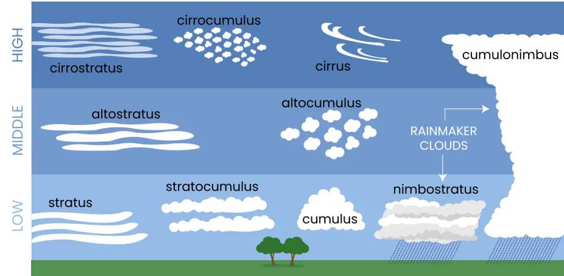
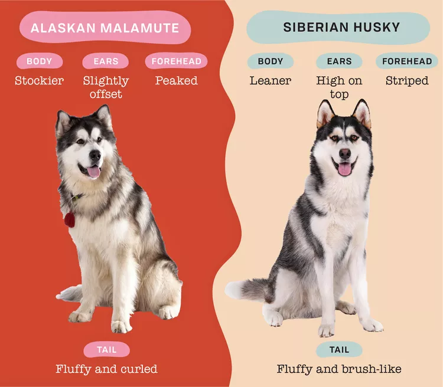
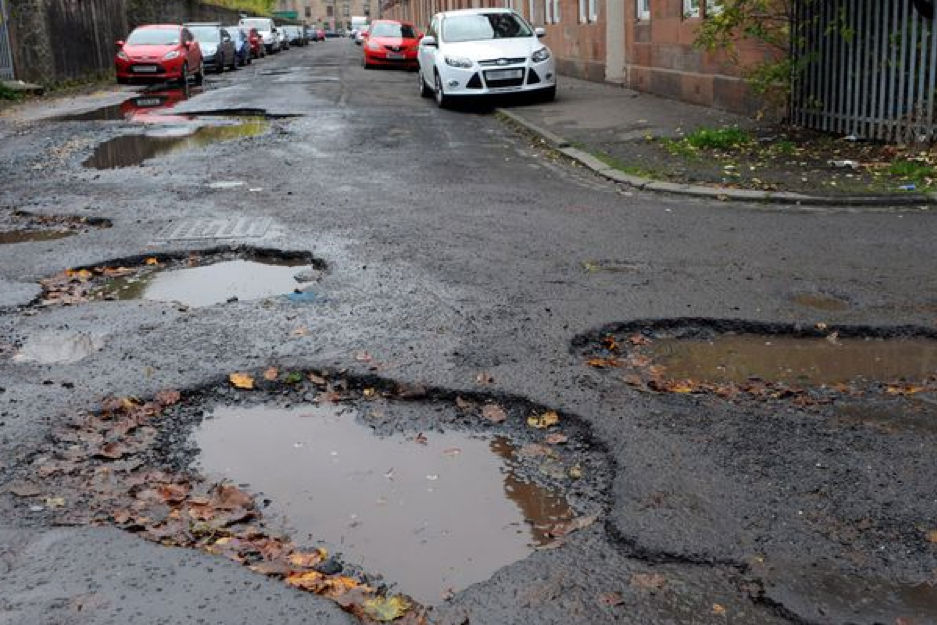

# Image Recognition Projects

Welcome to my Image Recognition Projects repository! Here, you will find a collection of machine learning models I have developed as part of my self-study in image recognition and classification. Each project showcases different aspects of image classification using transfer learning on convolutional neural networks, and through these projects, I have gained valuable insights and skills in machine learning.

## [Project 4: Multi-Label Photo Classification](multi-label-classification.ipynb)

### Overview
The fourth project is a multi-label classification model that recognizes multiple labels in photos. This project demonstrates the ability to handle images that belong to more than one category simultaneously.

### What I Learned
- **Multi-Label Classification**: I explored the challenges and techniques involved in building multi-label classifiers, such as handling overlapping labels and ensuring proper loss calculation.
- **Data Augmentation**: I used data augmentation techniques and hyperparameter tuning to increase the diversity of the training set and improve model robustness.
- **Performance Metrics**: I learned about evaluation metrics specific to multi-label classification, such as Hamming loss and the subset accuracy metric.
- **Application Deployment**: I deployed the model and created an interactive demo. <https://huggingface.co/spaces/Dkeruan/multi-labeling>

## [Project 3: Ground-Based Cloud Classification](cloud_type_classification.ipynb)

### Overview
The third project is focused on classifying three main types of clouds using ground-based cloud photos. This project is particularly relevant for meteorological studies and weather prediction.

### What I Learned
- **Multi-Class Classification**: I learned how to build and evaluate multi-class classification models, handling multiple categories within a single dataset.
- **Data Transformations**: I utilized various data augmentation techniques such as randomized cropping, perspective warping, and rotations.
- **Data Cleaning**: I learned to minimize the loss function by addressing errors in the dataset.
- **Model Evaluation**: I practiced evaluating multi-class classifiers using confusion matrices and class-wise performance metrics.
- **Web App Deployment**: I learned to transform code into a script and deploy the script into an interactive web application for users.

## [Project 2: Huskies vs. Malamutes](is-it-a-husky-or-malamute.ipynb)

### Overview
The second project involves creating a classifier that differentiates between Huskies and Malamutes. These two breeds of dogs are visually similar, making it a challenging and interesting classification problem.

### What I Learned
- **Feature Extraction**: I delved into feature extraction techniques to understand what features the model focuses on when distinguishing between similar classes.
- **Model Optimization**: I learned about hyperparameter tuning and experimented with different optimization techniques to improve model accuracy.
- **Visualization**: I utilized visualization tools to interpret and visualize the regions of images that the model considered important for making predictions.

## [Project 1: Clean Street vs. Streets with Potholes](is-it-a-pothole.ipynb)

### Overview
The first project in this repository is a binary classifier that distinguishes between images of clean streets and streets with potholes. This project aims to demonstrate how machine learning can be used to identify and classify road conditions, which can be useful for urban planning and maintenance.

### What I Learned
- **Data Collection and Preprocessing**: I learned how to collect data from online searches, categorize it into different paths, and transform it with various data augmentation techniques found in the fast.ai API.
- **Transfer Learning**: I explored transfer learning by leveraging pre-trained models like resnet18 and fine-tuning them for my specific task.
- **Evaluation Metrics**: I gained an understanding of different evaluation metrics such as accuracy, precision, recall, and F1-score, and how to use them to assess model performance.

## Conclusion

Through these projects, I have gained a solid foundation in image recognition and classification using machine learning. Each project has helped me understand different aspects of the field, from data preprocessing and feature extraction to model optimization and evaluation. I look forward to continuing my journey in machine learning and exploring more complex and diverse problems.

Feel free to explore the code and models in this repository. Feedback and suggestions are always welcome!

